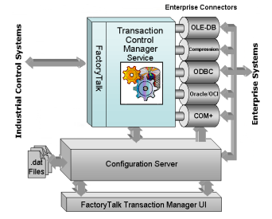
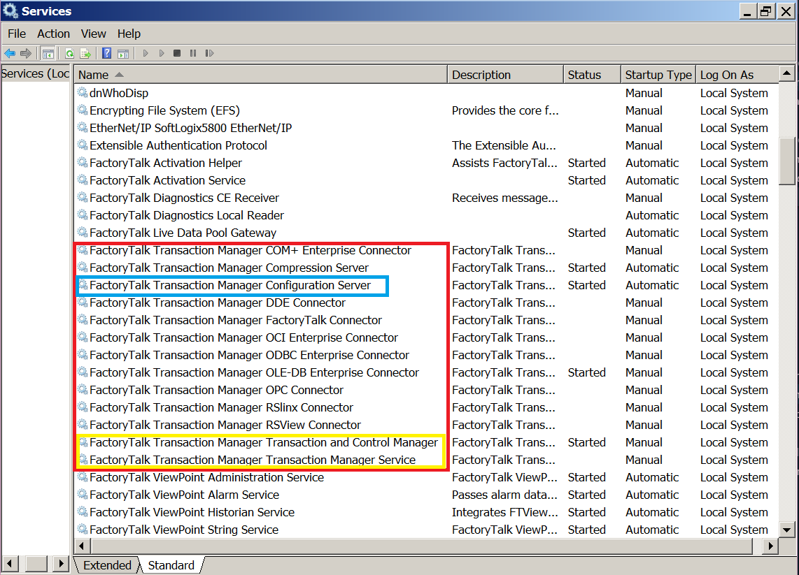

## 基本概念 ##

**FactoryTalk Transaction Manager**（前身是RSSql）是Rockwell公司FactoryTalk系列组态软件之一，主要实现工控系统与数据库的通信，该系列软件基于[SOA架构](https://baike.baidu.com/item/SOA/2140650)开发，因此Transaction Manager应用软件部分实际上是对各个数据传送服务进行配置的UI界面，该软件的核心实际上是各个接口的服务程序。
<!--more-->

Transaction and Control Manager服务包含了Transaction Manager Service服务和FactoryTalk Live Data控制接口，可以通过该服务连接Rockwell软件和所有OPC服务器。

启动操作系统后查看服务列表，可以看到Transaction Manager相关的各个服务。

FactoryTalk Transaction Manager可以使用以下**控制接口**(control connector)，来关联数据点(data point)或存储地址(memory location)：
1. FactoryTalk Live Data
2. Dynamic Data Exchange (DDE)
3. RSLinx Classic OPC
4. RSView32
5. Generic OPC

FactoryTalk Transaction Manager可以使用以下**企业接口**(enterprise connector)，来创建数据对象(data object)与企业系统中的数据表(database table)和预存过程(stored procedure)进行交互：
1. Open Database Connectivity (ODBC)
2. Microsoft OLE DB
3. Microsoft COM+
4. Oracle Call Interface (OCI)
5. Time-series Data Compression
6. FactoryTalk Metrics connector

## 1. OPC Server -> SQL Server ##

OPC Server: KEPSever Enterprise 5.13
SQL Server: Microsoft SQL Server 2008 R2

## 2. Live Data -> SQL Server

## 3. SQL Server -> Live Data
