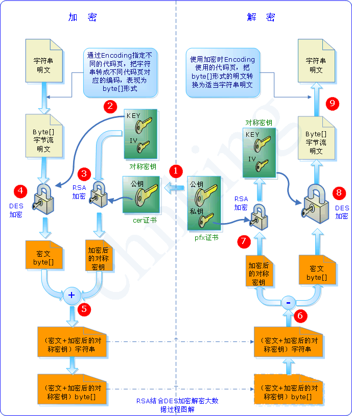

**对称加密**是指加密与解密使用同样的密钥，安全性取决于密钥长度。密钥大小要考虑安全性和效率的权衡，一般小于256bit。对称加密的一大缺点是密钥的管理和分配， 将密钥发送到请求方的过程中有很大风险会被拦截。常用的对称加密算法有DES和AES。

**非对称加密**使用了一对密钥，公钥发送给任何请求它的人，私钥由自己保管。与对称加密相比，非对称加密安全性大大提高，但是效率很低。常用的非对称加密算法是RSA。
**公钥**与**私钥**成对出现，公钥用来加密和验章，私钥用来解密和签章，用公钥加密的内容只能用私钥解密，用私钥加密的内容只能用公钥解密。
当用户接受文件时，对方用该用户的公钥加密，该用户用自己的私钥解密，保证该信息只能由他看到，即安全传输。
当用户发送文件时，用自己的私钥签名，对方用该用户的公钥解密，保证信息是由该用户发出的，即**数字签名**。签名加密的内容与文件内容有关时，可以验证文件内容在发送过程中未被修改。

为了弥补对称加密的安全性问题和非对称加密的效率问题，通常采用两者结合的方式，将对称加密的密钥通过非对称加密发送出去。

CA(Certificate Authority)即证书授权中心，是负责管理和签发证书的第三方机构，一般来说CA具有足够的权威性，是所有行业和公众认可的。证书授权中心将申请者的公钥、申请者和颁发者信息以及自己的签名一起用自己的私钥加密，生成**数字证书**。发送方只需将数字证书附上，接收方使用CA的公钥解密数字证书，得到发送方的真实公钥，避免公钥和数字签名被篡改。
颁发者和使用者相同的证书为**自签名证书**。**根证书**是CA给自己颁发的证书，是信任链的起始点，安装CA根证书意味着对这个CA的信任。

证书的编码格式通常有PEM（base64编码）和DER（二进制编码）。

 - .crt .cer 证书文件
 - .key 私钥文件
 - .csr 证书签名请求
 - .pfx .keystore 包含证书和私钥（需要密码）

在Windows中可以通过在命令提示符中输入certmgr打开证书管理工具。

Reference 
[知乎专栏——公钥和私钥](https://zhuanlan.zhihu.com/p/31477508)
[理解公钥和私钥](https://songlee24.github.io/2015/05/03/public-key-and-private-key/)