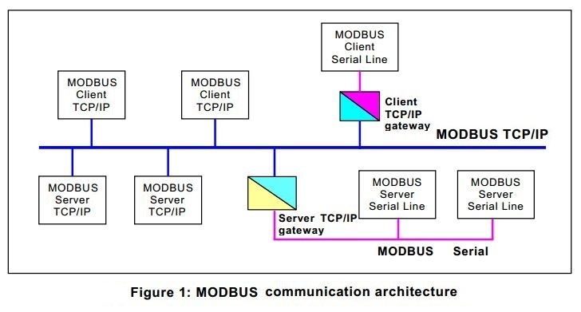
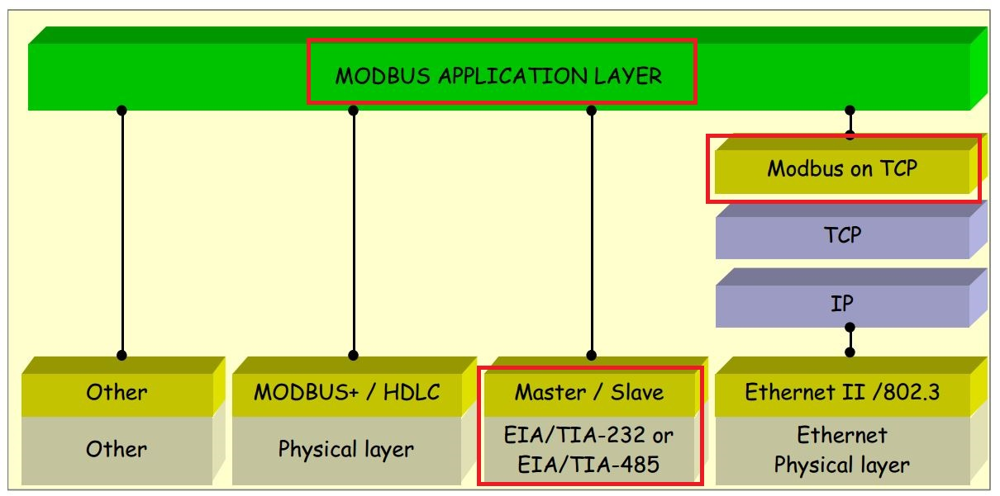
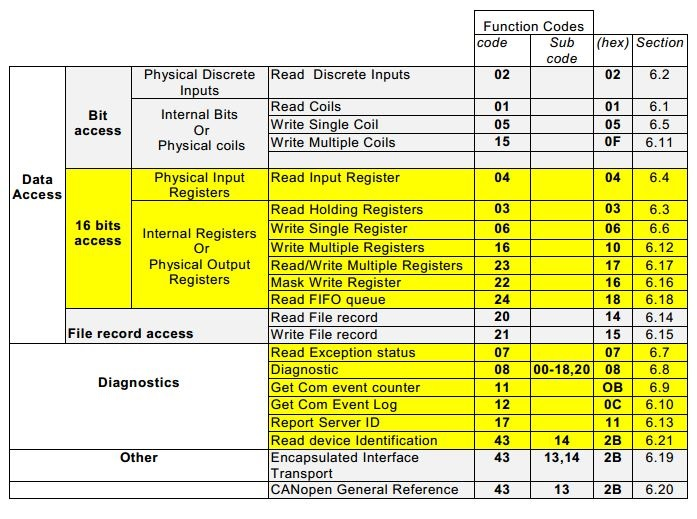

### Modbus历史 ###
**Modbus协议**最早由Modicon公司（现为施耐德电气公司的品牌）于1979年开发，旨在实现可编程控制器(PLC)之间的通信，后逐渐被大多数公司认可，成为事实上的标准协议，是**全球第一个真正用于工业现场的总线协议**。
该公司后来还推出增强型Modbusplus(MB+)协议，完整定义了通信协议、网络结构、线缆等，是典型的令牌环网，与Modbus差异较大。
2004年起施耐德电气已将Modbus协议的所有权移交并成立了**[Modbus组织](http://modbus.org/)**，为之后的发展奠定了基础。在中国，Modbus已经成为国家标准GB/T19582-2008。

### Modbus概述 ###
Modbus协议是一项应用层报文传输协议，包括ASCII、RTU、TCP三种报文类型，协议本身没有定义物理层，只是定义了消息帧格式、描述了设备请求和返回数据的过程以及侦测错误的手段等。在现实使用中，可以通过网关将串行链路(RS232/RS485)和以太网等不同物理连接网络通过Modbus协议组成统一的系统。

**Modbus协议栈**主要包括[Modbus应用层协议](http://modbus.org/docs/Modbus_Application_Protocol_V1_1b3.pdf)、[Modbus串行链路协议](http://modbus.org/docs/Modbus_over_serial_line_V1_02.pdf)和[Modbus在以太网上的映射](http://modbus.org/docs/Modbus_Messaging_Implementation_Guide_V1_0b.pdf)，相应的规范可点击链接下载。

### Modbus应用层协议 ###
Modbus应用层协议(OSI L7)规定了与下层实现无关的**协议数据单元**(Protocol Data Unit, PDU)，Modbus协议在某种总线或网络上的映射定义了**应用数据单元**(Application Data Unit, ADU)。不论是Modbus串行链路协议、以太网协议还是其他由Modbus衍生的协议，协议数据单元PDU都由**功能代码段**和**数据段**组成，数据段可以不存在。

#### 请求——回应模型 ####
在上层协议中，发出请求的一方为客户端Client，响应的一方为服务端Server。
在客户端发出请求消息中，功能代码告知服务端要执行何种功能。数据段包含了服务端要执行功能的任何附加信息。
如果服务端产生正常的回应，则返回相同的功能代码给客户端，数据段包括了服务端收集的数据；如果有错误发生，服务端将功能代码的MSB置1返回给客户端，同时数据段包含了描述此错误信息的代码。

#### 数据编码和类型 ####
采用**高字节序**(Big-Endian)，即高字节先发送、低字节后发送。
Modbus协议中只有两种数据类型，即位bit和字word(16-bit)，根据访问类型分为以下四种：

| 名称 | 类型 | 访问 | 内容 |
| :--: | :--: | :--: | :-- |
| 离散量输入(Discrete Input) | 位bit | 只读 | IO系统提供这种类型数据 |
| 线圈(Coil) | 位bit | 读写 | 通过应用程序改变这种类型数据 |
| 输入寄存器(Input Register) | 字word | 只读 | IO系统提供这种类型数据 |
| 保持寄存器(Holding Register) | 字word | 读写 | 通过应用程序改变这种类型数据 |

地址寻址从0开始，详细的设备地址映射参见具体设备手册。

#### 功能代码 ####
功能代码段占用1个字节，取值范围为1-255，其中128-255为保留值，用于异常消息应答报文（原功能代码MSB置1）；1-127为功能代码编号，其中65-72和100-110为用户自定义功能代码，其余取值为通用功能代码。**通用功能代码**(Public Function Code)是已经公布的功能代码，由确定的功能，用户不能修改。
常用的通用功能代码如下：
详细用法见[Modbus应用层协议](http://modbus.org/docs/Modbus_Application_Protocol_V1_1b3.pdf)。

### Modbus串行链路协议 ###
Modbus针对串行链路的协议规定了通信的物理层和数据链路层(OSI L1/2)。物理层采用多种物理接口，最常用的是EIA/TIA-485双线接口。

#### 主从模式 ###
数据链路层采用**主从通信模式(Master/Slave)**，只有一个主设备可以初始化通信，并对总线上所有从设备进行控制。
- 所有通信由主设备发出，从设备只能对主设备进行响应，互相不允许直接通信。
- 主设备对应上层协议中的客户端，从设备对应上层协议中的服务端。

在**单播模式**(Unicast Mode)中，主设备发送请求至某个特定的从设备，从设备接到请求后进行应答并把消息反馈给主设备；在**广播模式**(Broadcast Mode)中，主设备可同时向多个从设备发送请求（设备地址0），从设备对广播请求不进行响应。
对于串行链路，应用数据单元ADU最大长度为256字节，协议数据单元PDU最大长度为253字节。
由于主站一次只能读取一个从站的数据，Modbus通信采用轮询方式，用在实时性要求较低的场合。

#### 报文格式 ####
串行链路的通用Modbus报文（消息帧）形式如下：

**1. Modbus-RTU**
  - 该模式中直接发送二进制数据流，以至少3.5个字符时间的停顿间隔分隔两帧，作为两帧开始和终止的标志，整个消息帧必须为连续的传输流，同一帧的两个数据间隔不能超过1.5个字符时间
  - 在传输过程中需要定时器，从设备不断侦测总线及停顿间隔，当第一个域（即地址域）接收到，每个从设备都进行解码以判断是否发给自己
  - 数据校验采用CRC（循环冗余校验），详见
  - 地址域1个字节，功能代码1个字节，CRC校验2个字节，数据至多为252字节

**2. Modbus-ASCII**
- 该模式中消息的每个字节用16进制表示0x00-0xff，转化为两个ASCII字符进行发送，可以使用的传输字符是0-9、A-F，消息帧以字符":"(ASCII码3A)作为起始符，以回车换行符(ASCII码0D,0A)作为终止符，同一帧的两个数据间隔可至多达到1s
- 在传输过程中不需要定时器，从设备不断侦测":"字符，当接收到时每个设备都解码下个域（即地址域）来判断是否发给自己
- 数据校验采用LRC（纵向冗余校验），检测消息帧中除了开始符和终止符外的内容
- 起始符1个字节，地址域2个字节，功能代码2个字节，LRC校验2个字节，终止符2个字节，数据至多为2*252字节
- 该模式也称为命令行模式，由于发送的是可视化字符串，调试简便，但该模式传输效率较低

### Modbus以太网协议 ###
基于Modbus协议进行以太网传输有多种形式，官方文档中给出的是基于Ethernet TCP/IP的Modbus TCP/IP（即Modbus-TCP），定义了TCP传输的报文格式以及默认端口号502。除此之外还有Modbus over TCP/IP（将Modbus-RTU/ASCII报文作为TCP数据包）、Modbus UDP/IP、Modbus over UDP/IP等非标准变体。

#### Modbus-TCP报文格式 ####
Modbus-TCP报文（消息帧）形式如下：
数据以类似Modbus-RTU的二进制数据流发送。由于Ethernet TCP/IP数据链路层的校验机制保证了数据的完整性，报文中不含有数据校验，也没有地址域。同时Modbus-TCP加入了4个域、7个字节的报文头来识别应用数据单元ADU，称为**MBAP报文头**(Modbus Application Protoco Header)，具体形式如下：

1. 事务处理标识符：用于事务处理配对，在响应中服务端复制请求的事务处理标识符
2. 协议标识符：用于系统内多路复用，通过值0识别Modbus协议
3. 长度：单元标识符和PDU的长度
4. 单元标识符：用于以太网和串行链路间的网关对串行链路从站的通信

#### Modbus-RTPS ####
To be continued...

More [Modbus库和仿真软件](http://www.modbustools.com/)