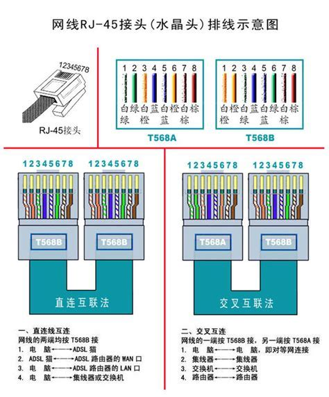
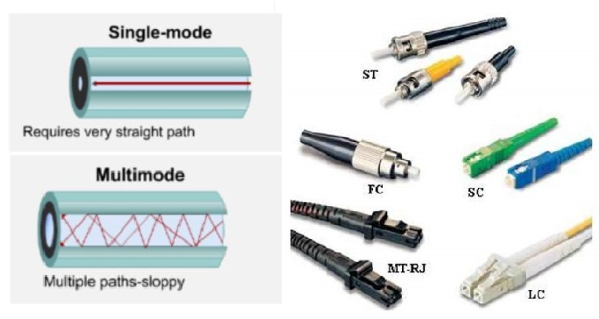

数字表示网络数据传输速率，单位为Mbps；Base表示基带传输，即未经过调制、不能复用的传输，Broad表示宽带传输；-后面的字母或数字指传输介质。
<!--more-->
IEEE标准共有以下几种：

| 名称 | 传输介质 | 传输距离 | 连接器 |
| :--: | :-----: | :------: | :---: |
| 10Base-5 | RG-8/RG-11同轴电缆（粗缆） | 500米 | AUI或MAU连接器 |
| 10Base-2 | RG-58同轴电缆（细缆） | 185米 | BNC连接器 |
|**10Base-T**| CAT3非屏蔽双绞线 | 100米 | RJ45连接器 |
| 10Base-F | 光纤 | 500米以上 | FP/FL/FB连接器 |
|**100Base-TX**|CAT5非屏蔽双绞线 | 100米 | RJ45连接器 |
| 100Base-T4 | CAT3非屏蔽双绞线 | 100米 | RJ45连接器|
| 100Base-F | 光纤 | 2000米 | SC |
|**1000Base-T**| CAT5e非屏蔽双绞线 | 100米 | RJ45连接器 |
|**1000Base-TX**| CAT6非屏蔽双绞线 | 100米 | RJ45连接器 |
| 1000Base-CX | 屏蔽双绞线 | 25米 | RJ45连接器 |
| 1000Base-LX | 单模光纤 | 3000米 | SFP |
| 1000Base-SX | 多模光纤 | 300-550米 | |

**双绞线**把两根22-26号绝缘铜导线按一定密度互相绞在一起，每一根导线在传输中辐射出来的电波会被另一根线上发出的电波抵消，有效降低信号干扰的程度。与其他传输介质相比，双绞线在传输距离，信道宽度和数据传输速度等方面均受到一定限制，但价格较为低廉，应用非常广泛。
**屏蔽双绞线**在双绞线与外层绝缘封套之间有一个金属屏蔽层。**STP**(Shielded Twisted Pair)指每条线都有各自的屏蔽层，而**FTP**(Foil Twisted Pair)只在整个电缆有屏蔽装置，并且两端都正确接地时才起作用。屏蔽层可减少辐射，防止信息被窃听，也可阻止外部电磁干扰，屏蔽双绞线比同类的非屏蔽双绞线具有更高的传输速率。
**非屏蔽双绞线UTP**(Unshielded Twisted Pair)直径小、成本低、易弯曲、易安装，广泛用于以太网和电话线中。常见的非屏蔽双绞线由4对8根不同颜色的传输线组成。

按照频率带宽和信噪比双绞线可以分为：

| 名称 | 最高频率带宽 | 用途 | 
| :--: | :-----: | :------ | 
| CAT1 | 750kHz | 用于报警系统，不用于数据传输 |
| CAT2 | 1MHz | 用于语音传输和最高4Mbps的数据传输 |
| CAT3 | 16MHz | 用于10Base-T以太网和4Mbps令牌环 |
| CAT4 | 20MHz | 用于局域10Base-T/100Base-T以太网和16Mbps令牌环 |
| **CAT5** | 100MHz | 用于10Base-T/100Base-T网络 |
| CAT5e | 100MHz | 用于1000Base-T网络 |
| CAT6 | 250MHz | 用于最高1Gbps的数据传输 |
| CAT6A | 500MHz | 用于最高10Gbps的数据传输 |
| CAT7 | 600MHz | 用于最高10Gbps的数据传输 |

目前最常用的为CAT5和CAT6，CAT6以上的产品国家未出台正式检测标准。电话线接口常用RJ11连接器，网线接口常用RJ45连接器，都称为水晶头。

EIA/TIA标准规定了两种双绞线线序T568A和T568B，常用网线分为**直连互联**和**交叉互联**两种接法。
可以看作**数据终端设备**(Data Terminal Equipment, DTE)的有电脑、路由器、交换机uplink口、HUB级联口等，可以看**数据电路终接设备**(Data Circuit-terminating Equipment, DCE)的有交换机普通口、HUB普通口等。同类设备间相连使用交叉线方式，异类设备间相连使用直通线方式。现在的交换机通常具有端口自动翻转功能，因此对直通线和交叉线不加以区分。

**单模光纤**中心的玻璃芯很细，只能传播一种模式的光信号，在单模光纤中光沿直线传播，无反射，传播距离非常远，一般为黄色。**多模光纤**芯径较大，可以传输多种模式的光信号，一般为橘红色或灰色，不同模光进入光纤的角度不同，它们到达另一端的时间也不同，称为**模分散**，模分散技术限制了多模光纤的带宽和距离。

常见的光纤接口包括SC（方形卡接式）、LC（圆形小）、DLC（圆形小双头）、FC（圆形带螺纹）、ST（圆形卡接式）和MTRJ（方形双头）等，插芯研磨平面又可以分为PC、UPC、APC等。
**光电转换器**又称光纤收发器，是一种将短距离电信号和长距离光信号进行互换的设备，目前最常用的光电转换器为热插拔小封装模块(Small Form-factor Pluggables, SFP)，具有体积小、端口多等优点，多采用LC接口。**光纤耦合器**又称分歧器，将光信号从一条光纤中分至多条光纤中。

