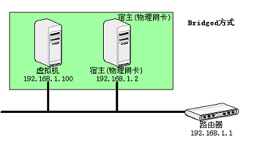
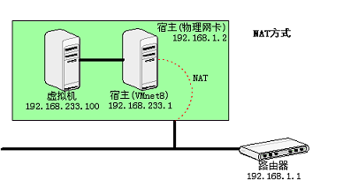
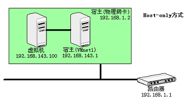

VMware虚拟机有三种网络模式，分别是**桥接模式(Bridged)**、**网络地址转换模式(NAT)**、**仅主机模式(Host-only)**。

安装完成VMWare之后会自动生成三个虚拟网络，其中VMnet0用于桥接模式，VMnet1用于仅主机模式，VMnet8用于NAT模式，后两者提供DHCP服务不需要手动设定IP。

1. 桥接模式
该模式下虚拟机就像局域网中一台独立的主机，在分配局域网所要求的网络地址、子网掩码、网管等之后，与宿主计算机所在网络的其他计算机都可以互相访问。
若希望利用VMWare在局域网内建立虚拟服务器并为局域网用户提供网络服务，就应该选择桥接模式。
如果出现主机不能ping通虚拟机的情况，可以查看主机的防火墙的入站规则中对ICMP协议相关的配置文件是否启用。

2. NAT模式
该模式下虚拟机网卡连接到宿主计算机VMnet8网卡上，加设了一个虚拟的NAT服务器，虚拟机可以与宿主计算机互访，对外访问时使用的时宿主机的IP地址，而外部无法访问虚拟机。
若希望将虚拟机连接外部网络，这种模式最简单，不需要做任何网络设置。

3. 仅主机模式
该模式下虚拟机网卡连接到宿主计算机VMnet1网卡上，虚拟机只能与宿主计算机互访。
若希望创建与网内其他机器隔离的虚拟系统，进行特殊的网络调试工作，可以使用仅主机模式。

Reference 
[Vmware虚拟机下三种网络模式配置](https://blog.csdn.net/collection4u/article/details/14127671)
[理解VMWare的三种网络连接模式(bridged、NAT、host-only)](http://penpenguanguan.com/337.html)
