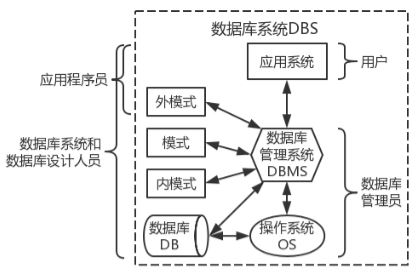
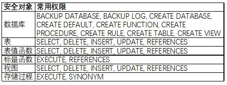

**《数据库原理与应用——SQL Server 2016版本》 主编：邓立国 佟强 清华大学出版社 2017年9月第1版 TP311.138 ISBN: 978-7-302-48305-2 **
本书系统地讲述数据库原理与SQL Server 2016的功能、应用及实践知识，包括关系数据库知识、数据库创建与维护、数据库表的操作管理及维护、完整性控制、查询与管理表数据、Transaction-SQL编程、存储过程和触发器、数据库安全管理、数据库系统开发配置连接等知识。
笔记在该书基础上重新组织并扩展内容，旨在完整地梳理SQL Server数据库知识以供学习和查阅。
<!--more-->
<!-- toc -->

## 第一章 数据库基础知识

### 1.1 数据库系统概论
**数据**(Data)是指能输入计算机并能被计算机程序处理的所有符号，是数据库中存储的基本对象。数据被赋予的含义称为数据的语义。
**数据库**(DataBase, DB)是指在计算机存储设备上建立起来的用于存储数据的仓库。按照一定的数学模型组织、描述和存储数据，使得数据库中的数据具有尽可能小的冗余度、较高的独立性和易扩展性。
**数据库管理系统**(DataBase Management System, DBMS)是指位于用户和操作系统之间的数据管理软件，实现数据和数据库的管理和操作。
**数据库系统**(DataBase System, DBS)是指带有数据库并利用数据库技术管理数据的计算机系统，一般由满足一定要求的计算机硬件和包括数据库、数据库管理系统、数据库应用开发系统在内的计算机软件，以及相关人员组成。

对数据的管理经理了人工管理、文件系统管理和数据库管理三个主要阶段，数据库管理的主要优势为：数据结构化、数据共享性和独立性高、冗余度低、易扩充。

### 1.2 数据模型和数据库模式结构
**数据模型**是对现实世界进行模拟与抽象，是一组概念的集合，是数据库系统的核心和基础。

数据模型通常由数据结构、数据操作和完整性约束三个部分组成。
**数据结构**是数据对象的集合，描述了数据对象的类型、内容、属性及数据对象之间的关系，是对系统静态特性的描述。**数据操作**是允许执行操作的集合，是对系统动态特性的描述。**数据完整性约束**是规则的集合，是对数据之间制约和依存关系的描述，用于保证数据的完整性和一致性。

数据模型分为概念模型、逻辑模型和物理模型三个抽象层级。
**概念模型**是现实世界到信息世界的抽象，用符号记录现实世界的信息，与具体的计算机系统无关。基本概念有实体（客观存在并可相互区别的事务）、属性（实体所具有的某一特性）、码（唯一标识实体的属性集合）、域（属性的取值范围）、实体型（同类实体的共同属性）、实体集（同类实体的集合）、联系（包括实体型内部各个属性的联系和实体型之间的联系）。两个实体型之间的联系可以分为一对一、一对多、多对多三种。概念模型最常用的表示方法是**实体-联系图**(Entity-Relationship Graph, E-R图)，矩形表示实体型，椭圆表示属性，无向边和菱形表示联系并标注联系类型。
**逻辑模型**是信息世界到计算机世界的抽象，不同的逻辑模型与DBMS有关。
目前比较成熟的逻辑模型有层次模型、网状模型和关系模型，层次模型以树结构表示数据之间的关联；网状模型以图结构表示数据之间的关联；关系模型以二维表表示数据之间的关联，概念单一、结构简单，建立在严格的数学概念基础上，是目前最重要、应用最广泛的逻辑模型。
**物理模型**是逻辑模型在计算机中的存储结构，包含数据的存储和数据之间联系的存储。

数据库系统通常采用三级模式和二级映象的系统结构，并以此保证了数据较高的逻辑独立性和物理独立性。**三级模式结构**是指外模式、模式和内模式，**二级映象**是指外模式/模式和模式/内模式的映象。
**外模式**也称子模型或用户模式，是数据库用户的数据视图，是与某一应用有关的数据逻辑表示，应用程序开发依赖于数据的外模式。
**模式**也称逻辑模式或概念模式，是数据库设计者用某种数据模型对全部数据的逻辑结构和特征的总体描述，是所有用户的公共数据视图。
**内模式**也称物理模式或存储模式，描述了数据在存储介质上的存储方式和物理结构，一个数据库只有一个内模式，内模式由内模式描述语言来定义。
**外模式/模式映象**实现了数据的逻辑独立性，即当数据的逻辑结构改变时，只需要改变相应的外模式/模式映象，不需要改变用户程序。对于每个外模式，数据库都有一个外模式/模式映象。
**模式/内模式映象**实现了数据的物理独立性，当数据的存储结构发生变化时，只需要数据库管理员改变相应的模式/内模式映象，不需要改变模式。数据库的模式/内模式映象是唯一的。

### 1.3 数据库系统组成
数据库系统包括计算机硬件、计算机软件和人员。
数据库系统中的人员主要分为四类：
**数据库系统和数据库设计人员**，前者负责应用系统需求分析和规范说明、确定系统硬件配置、参与数据库系统概要设计，后者负责数据库中数据的确定和各级模式的设计。
**应用程序员**负责编写使用数据库的应用程序，应用程序可以对数据进行检索、建立、删除或修改。
**最终用户**利用系统的接口或查询语言范围数据库。
**数据库管理员**(Database Administrator, DBA)负责数据库的总体信息控制，即决定信息内容和结构、决定存储结构和存取策略、定义安全性要求和完整性约束条件、监控运行情况、改进性能等。

## 第二章 数据库设计

## 第三章 数据库编程

### 3.1 关系数据库标准语言SQL
**结构化查询语言（Structured Query Language, SQL）**是关系数据库的标准语言，具有集数据查询、数据操作、数据定义和数据控制于一体的强大功能，通过九个动词来实现：SELECT、CREATE、DROP、ALTER、INSERT、UPDATE、DELETE、GRANT、REVOKE。

<!-- | SQL功能 | 动词 |
| :-----: | :--- |
| 数据查询 | SELECT |
| 数据定义 | CREATE、DROP、ALTER |
| 数据操纵 | INSERT、UPDATE、DELETE |
| 数据控制 | GRANT、REVOKE | -->

支持SQL的RDBMS同样支持关系数据库二级模式结构，外模式对应于视图和部分基本表，模式对应于基本表，内模式对应于存储文件的逻辑结构，其物理结构是任意的，对用户是透明的。各个RDBMS产品在实现标准SQL时有所差别。

### 3.2 SQL Server中的Transact-SQL语言
**Transact-SQL**是Microsoft SQL Server中对SQL-3标准的实现和扩展，具有SQL的主要特点，同时增加了多种语言元素，使其功能更加强大。
根据其具体完成的功能，可以将Transact-SQL语句分为四大类：
1. 数据定义语句：CREATE、DROP、ALTER等
2. 数据操纵语句：SELECT、INSERT、DELETE、UPDATE等
3. 数据控制语句：GRANT、DENY、REVOKE等
4. 附加的语言元素：BEGIN/END、COMMIT、ROLLBACK、DECLARE、SET、FETCH、CLOSE、EXECUTE等

数据库对象的名称即为**标识符**，对象标识符实在定义对象时创建的，之后用于引用该对象，但有些对象标识符是不可选的。按照标识符的使用方式可以分为两类，即常规标识符和分隔标识符，包含的字符数必须在1~128之间。
**常规标识符**的格式规则取决于数据库兼容级别，当兼容级别为100时，适用下列规则：
- 第一个字符必须是Unicode3.2所定义的字符，包括a-z、A-Z、其他语言的字符、_@#等。
- 后续字符可以包括Unicode3.2所定义的字符、数字、_@#$等
- 不能为Transact-SQL的保留字（大小写不区分）
- 不能嵌入空格、不能使用增补字符

**分隔标识符**是包含在双引号""或方括号[]内的标识符，符合标识符格式规则的可以分隔也可以不分隔，若包含保留字或使用了特殊字符，必须进行分隔。
在搜索数据库中的对象时，**通配符**包括：%（任意字符串）、_（任意字符）、[]集合中的字符、[^]不属于集合中的字符。

**常量**表示特定数据值。ASCII字符串常量用单引号，每个字符占一个字节，Unicode字符串常量在单引号前加大写N，每个字符用两个字节存储。十六进制整型常量用前缀0x表示，浮点用E表示。money常量以$为前缀；datetime常量使用特定格式字符表示；uniqueidentifier常量表示全局唯一标识符，可以指定字符格式或十六进制字符串格式。
**变量**在程序运行过程中会发生改变。**局部变量**是用户自己定义的变量，只能保存一个值，作用范围仅在程序内部。局部变量用以下语句来声明和赋值：

    DECLARE {@变量名 数据类型}[...n]
    SET @变量名 = 值 [,...n] （普通赋值）
    SELECT @变量名 = 值 [,...n] （查询赋值）

使用SELECT语句赋值时，若返回多个值则结果为返回的最后一个值。
**全局变量**也称配置函数，用于存储系统的特性信息，作用范围不限于某一程序，在服务器级定义，以@@开头，对于用户是只读的，常用的全局变量见书P155。

**运算符**按照起功能分类如下，优先级见书P159：
1. 算数运算符：+ - * / %
2. 赋值运算符：=
3. 逻辑运算符：ALL AND ANY BETWEEN EXISTS IN LIKE NOT OR SOME
4. 位运算符：& | ^ ~
5. 比较运算符：= > < >= <= <> != !< !>
6. 字符串串联运算符：+

### 3.3 程序设计接口ODBC与JDBC

## 第四章 认识SQL Server 2016

## 第五章 数据库操作

### 5.1 数据库的操作 ###
<!-- ## 3.1 数据定义
只有拥有DBA权限的用户才能调用创建模式的命令。创建和删除模式的语句：

    CREATE SCHEMA [模式名] AUTHORIZATION 用户名 [SQL语句]

    DROP SCHEMA 模式名 [{RESTRICT|CASCADE}]

基本表的定义和删除 -->

## 第六章 数据表操作
**表**是关系模型中表示实体的方式，是数据库存储数据的主要对象，同一数据库不能有相同表名。SQL Server中表由行和列组成，行称为**记录**，列称为**字段**，行和列的顺序都是任意的，一个表最多可以定义1024列且列名唯一。

视图和索引

### 6.1 数据类型

### 6.2 操作表
**创建表**一般要经过定义表结构、设置约束和添加数据三个步骤。设计表结构时需要确定表的名称、表包含的各个列名、数据类型和长度、能否为空值等。

数据表可以通过图形界面创建，也可以通过SQL语句：

    CREATE TABLE [数据库名][所有者]表名
    (
    列名 数据类型 [{NULL|NOT NULL}] [,... n]
    )
    [ON {文件组|"default"}]

**删除表**可以通过SQL语句：

    DROP TABLE 表名 [{RESTRICT|CASCADE}]

使用SQL语句**对表进行操作**，增加、删除列和修改列属性的语句：

    ALTER TABLE 表名
    ADD 列名 数据类型 [{NULL|NOT NULL}] [,... n]
    DROP COLUMN 列名 [,... n]
    ALTER COLUMN 列名 数据类型 [{NULL|NOT NULL}] [,... n]

此外，查看表的属性、重命名表、重命名列可以通过调用存储过程实现：

    EXEC sp_help
    EXEC sp_rename '旧名', '新名', {'TABLE'|'COLUMN'}

<!-- ### 6.3 操作数据
操作表数据同样可以通过图形界面或SQL语句实现。

 -->

### 6.4 表约束

## 第七章 数据操作

## 第八章 复杂查询

### 游标 ###

**游标**可以理解为一个定义在特定数据集上的指针，可以通过游标遍历数据集，或仅仅指向特定的行。在关系数据库中查询是面向集合的，而游标打破了这一规则，使操作变为逐行进行。使用游标会占用更多内存，减少可用并发，锁定资源，以及更多的代码量。

定义游标：

    DECLARE 游标名 CURSOR 
        [{LOCAL|GLOBAL}
         {FORWARD_ONLY|SCROLL}
         {STATIC|KEYSET|DYNAMIC|FAST_FORWORD}
         {READ_ONLY|SCROLL_LOCKS|OPTIMISTIC}
         TYPE_WARNING]
        FOR SQL语句
        [ FOR UPDATE [ OF column_name [ ,...n ] ] ]

定义游标为局部游标(LOCAL)，需像定义局部变量一样在游标名前加"@"，批处理结束后被释放；定义游标为全局游标(GLOBAL)，只支持定义时直接赋值，在批处理结束后依然有效。
只进游标(FORWARD_ONLY)意味着游标只能从数据集开始向结束方向读取，只能用FETCH NEXT；滚动游标(SCROLL)支持游标在定义的数据集中向任何方向或位置移动。
STATIC意味着游标建立时会创建副本，对真实表内数据的更改不会影响到游标内容；DYNAMIC与其完全相反；KEYSET是介于前两者的折中方案，将游标所在的结果集的主键存入临时表，当结果集中行改变或删除时游标内容改变，但新加入的数据不会造成游标内容改变；FAST_FORWARD根据情况选择采用动态计划或静态计划。
READ_ONLY代表游标只能读取数据，不能做任何更新；SCROLL_LOCKS将读入数据进行锁定，防止其他程序更改，以确保更新成功；OPTIMISTICS不锁定任何数据，根据底层表数据更新情况来决定更新游标内数据是否成功。

打开/关闭/释放游标：

    {OPEN|CLOSE|DEALLOCATE} 游标名

使用游标分为两部分操作，一是操作游标在数据集内的指向，二是对游标所指向行的操作。游标移动选项一共6种，分别为第一行(FIRST)、最后一行(LAST)、下一行(NEXT)、上一行(PRIOR)、直接跳到某行(ABSOLUTE(n))、相对目前跳几行(RELATIVE(n))。
游标经常会和全局变量@@FETCH_STATUS和WHILE循环来共同使用，以达到遍历游标所在数据集的目的。

使用游标的注意事项：
1. 尽量不要用，尤其是大量数据
2. 尽量使用FAST_FORWARD，避免使用INSENSITIVE/STATIC/KEYSET这些参数
3. 如果只对数据进行读取并只用到FETCH NEXT选项，最好使用FORWARD_ONLY
4. 用完之后一定要关闭和释放

## 第九章 函数、存储过程与触发器

### 10.1 存储过程

**存储过程**是由一系列Transact-SQL语句构成的程序，经编译后存储在数据库中，可以通过名称直接调用。存储过程还可以接受参数，提高存储过程的灵活性。在SQL Server中，存储过程的类型主要有：用户存储过程、扩展存储过程和系统存储过程。**用户存储过程**包括Transact-SQL存储过程和CLR存储过程；**扩展存储过程**可以加载外部DLL；**系统存储过程**用来实现数据库的管理活动，存放在master中，但其他数据库也可以调用。常用系统存储过程和分类见书P301。

创建和修改存储过程：

    {CREATE|ALTER} PROC[EDURE] 存储过程(组)名[;序号]
    [{@参数名 数据类型} [=默认值] [OUTPUT]] [,... n]
    [WITH {RECOMPILE|ENCRYPTION|RECOMPILE,ENCRYPTION}]
    [FOR REPLICATION]
    AS {SQL语句 [,... n]} 

删除存储过程：

    DROP PROC[EDURE] 存储过程(组)名

执行存储过程：

    EXEC[UTE] 存储过程(组)名[;序号]
    [[@参数名=]参数值|@参数名 [OUTPUT]|[DEFAULT]] [,... n]
    [WITH RECOMPILE]

### 10.2 触发器

**触发器**是一种特殊的存储过程，可以看作是表定义的一部分，用于对表进行完整性约束。在SQL Server中，触发器的类型主要有：DML触发器、DDL触发器和登录触发器。

当数据库中发生数据操纵语言(DML)事件时将调用**DML触发器**。按照触发操作的不同可以分为INSERT触发器、UPDATE触发器和DELETE触发器，SQL Server为每个语句创建deleted表或（和）inserted表，表结构与定义触发器的表结构相同，触发器执行完成后自动删除。按照触发时间的不同可以分为AFTER(FOR)触发器和INSTEAD OF触发器。
当数据库中发生数据定义语言(DLL)事件时将调用**DLL触发器**，主要用于任务管理。DLL事件主要包括CREATE/ALTER/DROP/GRANT/DENY/REVOKE等语句操作。
LOGON事件激发**登录触发器**，将在登录身份验证阶段完成之后用户会话建立之前触发。

创建和修改DML触发器：

    {CREATE|ALTER} TRIGGER [模式名.]触发器名
    ON {表名|视图名}
    [WITH DML触发器选项 [,... n]]
    {FOR|AFTER|INSTEAD OF}
    {[INSERT][,][UPDATE][,][DELETE]}
    AS {SQL语句 [,... n]}

删除DML触发器：

    DROP TRIGGER 触发器名 [,... n]

创建和修改DLL触发器发：

    {CREATE|ALTER} TRIGGER 触发器名
    ON {DATABASE|ALL SERVER}
    [WITH DLL触发器选项 [,... n]]
    {FOR|AFTER} {触发事件名称|触发事件分组名称} [,... n]
    AS {SQL语句 [,... n]}
其中常见的数据库作用域的DLL语句和服务器作用域的DLL语句见P315。

删除DLL触发器：

    DROP TRIGGER 触发器名 [,... n]
    ON {DATABASE|ALL SERVER}

启用和禁用触发器：

    {ENABLE|DISABLE} TRIGGER {[模式名.]触发器名 [,... n]|ALL}
    ON {表名|视图名|DATABASE|ALL SERVER}

## 第十章 事务、定时作业和错误日志
事务

## 第十章 数据库安全

### 10.4 权限管理

**权限**是执行操作、访问数据的通行证。
**预定义权限**是指不必通过授予即拥有过的权限，如数据库角色所拥有的权限。**未预定义权限**是指经过授权或集成才能得到的权限，大多数安全主体都需要经过授权才能获取安全对象的使用权限。

**针对所有对象的权限**包括：
TAKE OWNERSHIP权限，允许被授权者获得安全对象的所有权。
CONTROL权限，被授权者拥有对安全对象所定义的所有权限，但不具有安全对象的所有权。
ALTER权限，被授权者可以更改特定安全对象。
ALTER ANY权限，被授权者可以更改特定安全对象类型。
IMPERSONATE权限，被授权者模拟指定的用户执行各种操作。
CREATE权限，被授权者可以创建安全对象。
VIEW DEFINITION权限，被授权者可以查看数据库元数据。

**针对特定对象的权限**包括：
SELECT（查询）权限、UPDATE（更新）权限、INSERT（插入）、DELETE（删除）权限、EXECUTE（执行）权限、REFERENCE（引用）权限。

授予权限，在安全系统中创建一项使角色或用户获得权限：

    GRANT {ALL|权限名[,..n]} [ON 安全对象] 
    TO 被授权者[,..n] [WITH GRANT OPTION]

WITH GRANT OPTION允许被授权者将权限授予其他用户。

拒绝权限，在安全系统中创建一项禁止角色或用户获得或继承权限：

    DENY [GRANT OPTION FOR] {ALL|权限名[,..n]} [ON 安全对象] 
    {TO|FROM} 被授权者[,..n] [CASCADE]

GRANT OPTION FOR撤销授予指定权限的能力。CASCADE表示撤销当前主体权限的同时，还撤销当前主体为其他主体授予的权限。

收回权限，删除安全系统中授予或拒绝角色或用户的权限。

    REVOKE [GRANT OPTION FOR] {ALL|权限名[,..n]} [ON 安全对象] 
    {TO|FROM} 被授权者[,..n] [CASCADE]

可选参数含义同上。

> To Be Continued