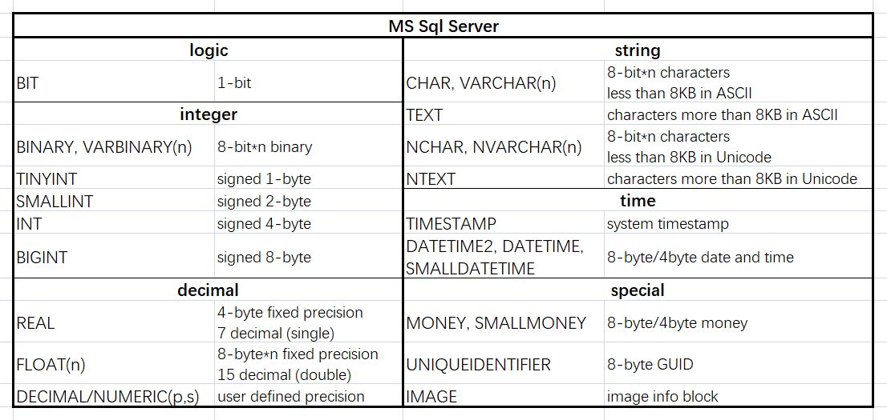

**《数据库原理与应用——SQL Server 2016版本》 主编：邓立国 佟强 清华大学出版社 2017年9月第1版 TP311.138 ISBN: 978-7-302-48305-2 **
本书系统地讲述数据库原理与SQL Server 2016的功能、应用及实践知识，包括关系数据库知识、数据库创建与维护、数据库表的操作管理及维护、完整性控制、查询与管理表数据、Transaction-SQL编程、存储过程和触发器、数据库安全管理、数据库系统开发配置连接等知识。
<!--more-->
<!-- toc -->

## 第一章 数据库基础知识

<!-- ## 第三章 关系数据库标准语言SQL -->
<!-- **结构化查询语言（Structured Query Language, SQL）**是关系数据库的标准语言，具有集数据查询、数据操作、数据定义和数据控制于一体的强大功能。

| SQL功能 | 动词 |
| :-----: | :--- |
| 数据查询 | SELECT |
| 数据定义 | CREATE、DROP、ALTER |
| 数据操纵 | INSERT、UPDATE、DELETE |
| 数据控制 | GRANT、REVOKE |

支持SQL的RDBMS同样支持关系数据库二级模式结构，外模式对应于视图和部分基本表，模式对应于基本表，内模式对应于存储文件的逻辑结构，其物理结构是任意的，对用户是透明的。各个RDBMS产品在实现标准SQL时有所差别。 -->

<!-- ## 3.1 数据定义
只有拥有DBA权限的用户才能调用创建模式的命令。创建和删除模式的语句：

    CREATE SCHEMA [模式名] AUTHORIZATION 用户名 [SQL语句]

    DROP SCHEMA 模式名 [{RESTRICT|CASCADE}]

基本表的定义和删除 -->

## 第四章 数据库设计与编程

## 第六章 数据库操作

## 第七章 数据表操作
**表**是关系模型中表示实体的方式，是数据库存储数据的主要对象，同一数据库不能有相同表名。SQL Server中表由行和列组成，行称为**记录**，列称为**字段**，行和列的顺序都是任意的，一个表最多可以定义1024列且列名唯一。

### 7.1 数据类型

### 7.2 操作表
**创建表**一般要经过定义表结构、设置约束和添加数据三个步骤。设计表结构时需要确定表的名称、表包含的各个列名、数据类型和长度、能否为空值等。

数据表可以通过图形界面创建，也可以通过SQL语句：

    CREATE TABLE [数据库名][所有者]表名
    (
    列名 数据类型 [{NULL|NOT NULL}] [,... n]
    )
    [ON {文件组|"default"}]

**删除表**可以通过SQL语句：

    DROP TABLE 表名 [{RESTRICT|CASCADE}]

使用SQL语句**对表进行操作**，增加、删除列和修改列属性的语句：

    ALTER TABLE 表名
    ADD 列名 数据类型 [{NULL|NOT NULL}] [,... n]
    DROP COLUMN 列名 [,... n]
    ALTER COLUMN 列名 数据类型 [{NULL|NOT NULL}] [,... n]

此外，查看表的属性、重命名表、重命名列可以通过调用存储过程实现：

    EXEC sp_help
    EXEC sp_rename '旧名', '新名', {'TABLE'|'COLUMN'}

<!-- ### 7.3 操作数据
操作表数据同样可以通过图形界面或SQL语句实现。

 -->

### 7.4 表约束

## 第八章 数据操作

## 第十章 存储过程与触发器

**存储过程**是由一系列Transact-SQL语句构成的程序，经编译后存储在数据库中，可以通过名称直接调用。存储过程还可以接受参数，提高存储过程的灵活性。在SQL Server中，存储过程的类型主要有：用户存储过程、扩展存储过程和系统存储过程。**用户存储过程**包括Transact-SQL存储过程和CLR存储过程；**扩展存储过程**可以加载外部DLL；**系统存储过程**用来实现数据库的管理活动，存放在master中，但其他数据库也可以调用。常用系统存储过程和分类见书P301。

创建和修改存储过程的语法：

    {CREATE|ALTER} PROC[EDURE] 存储过程(组)名[;序号]
    [{@参数名 数据类型} [=默认值] [OUTPUT]] [,... n]
    [WITH {RECOMPILE|ENCRYPTION|RECOMPILE,ENCRYPTION}]
    [FOR REPLICATION]
    AS {SQL语句 [,... n]} 

删除存储过程的语法：

    DROP PROC[EDURE] 存储过程(组)名

执行存储过程的语法：

    EXEC[UTE] 存储过程(组)名[;序号]
    [[@参数名=]参数值|@参数名 [OUTPUT]|[DEFAULT]] [,... n]
    [WITH RECOMPILE]

**触发器**是一种特殊的存储过程，可以看作是表定义的一部分，用于对表进行完整性约束。在SQL Server中，触发器的类型主要有：DML触发器、DDL触发器和登录触发器。

当数据库中发生数据操纵语言(DML)事件时将调用**DML触发器**。按照触发操作的不同可以分为INSERT触发器、UPDATE触发器和DELETE触发器，SQL Server为每个语句创建deleted表或（和）inserted表，表结构与定义触发器的表结构相同，触发器执行完成后自动删除。按照触发时间的不同可以分为AFTER(FOR)触发器和INSTEAD OF触发器。
当数据库中发生数据定义语言(DLL)事件时将调用**DLL触发器**，主要用于任务管理。DLL事件主要包括CREATE/ALTER/DROP/GRANT/DENY/REVOKE等语句操作。
LOGON事件激发**登录触发器**，将在登录身份验证阶段完成之后用户会话建立之前触发。

创建和修改DML触发器的语法：

    {CREATE|ALTER} TRIGGER [模式名.]触发器名
    ON {表名|视图名}
    [WITH DML触发器选项 [,... n]]
    {FOR|AFTER|INSTEAD OF}
    {[INSERT][,][UPDATE][,][DELETE]}
    AS {SQL语句 [,... n]}

删除DML触发器的语法：

    DROP TRIGGER 触发器名 [,... n]

创建和修改DLL触发器发的语法：

    {CREATE|ALTER} TRIGGER 触发器名
    ON {DATABASE|ALL SERVER}
    [WITH DLL触发器选项 [,... n]]
    {FOR|AFTER} {触发事件名称|触发事件分组名称} [,... n]
    AS {SQL语句 [,... n]}
其中常见的数据库作用域的DLL语句和服务器作用域的DLL语句见P315。

删除DLL触发器的语法：

    DROP TRIGGER 触发器名 [,... n]
    ON {DATABASE|ALL SERVER}

启用和禁用触发器的语法：

    {ENABLE|DISABLE} TRIGGER {[模式名.]触发器名 [,... n]|ALL}
    ON {表名|视图名|DATABASE|ALL SERVER}

## 第十一章 数据库安全

