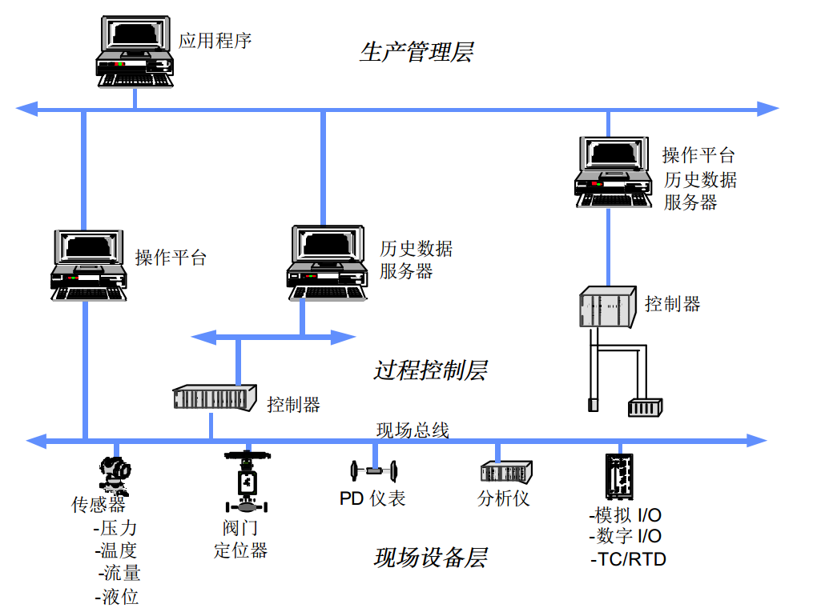

<!-- toc -->
《OPC应用程序入门》
<!--more-->

## 第一章 OPC基础知识 ##

### 1.1 什么是OPC ###

**OPC**(OLE for Process Control)是为不同供应商设备和应用程序之间的软件接口标准化而提出的，使其间的数据交换不依赖于特定开发语言和开发环境。它利用Windows中的OLE/COM技术实现**工业制造系统过程控制中数据交换的标准化**。OPC系统由提供数据收集服务的**OPC服务器**(OPC Server)、接受数据服务的**OPC应用程序**(OPC Client)和**OPC接口**所构成。

在OPC技术出现以前，**DDE**（Dynamic Data Exchange）技术曾经对过程控制做出巨大贡献，但是DDE是基于Windows信息传递而建立的技术，存在诸多问题。OPC基于**COM**（组件对象模型，Component Object Model）和**DCOM**（分布式COM）技术开发，实际上OPC是为工业标准定义的特殊的COM接口，与DDE相比在速度、分布式安全管理、开发成本、可靠性等方面都具有优势。

