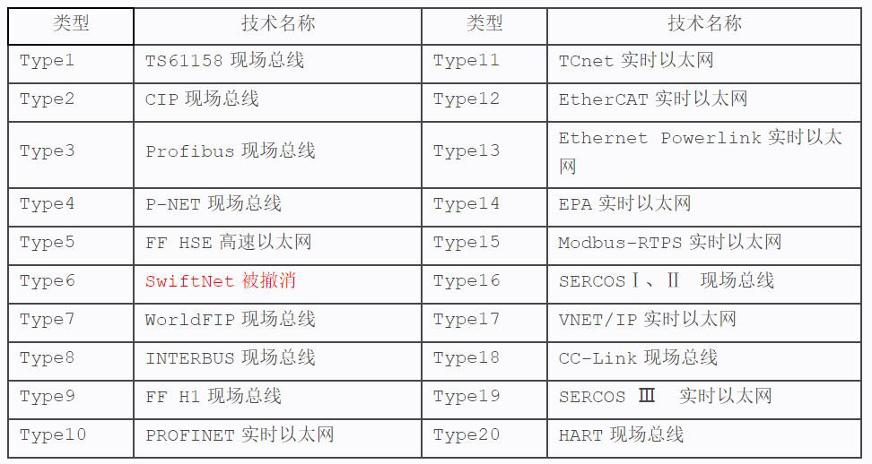

工业以太网、现场总线、工业无线是目前工业通信领域的三大主流技术。

<!--more-->

IEC 61158于2007年第四版标准规定了20种类型的通信协议：
其中Type1可以理解为FF现场总线，Type2包括DeviceNet、ControlNet和EtherNet/IP，Type6由于应用不理想被撤销。

常见工业现场总线一览：

| 名称    | 推出时间 | 主推公司 | 特点    |  链接  |
| :----:  | :----: | :----:| -----   | ---- |
| ASi (AS-Interface)  |  |  | $1      |       |
| CAN | 1986 | 博世 |  |  |
| CC-Link | 1996 | 三菱 |  |  |
| CompoNet |   |  |  |  |
| ControlNet | 1997 | 罗克韦尔 |  |  |
| DeviceNet |  |  |  |  |
| Fipio |  |  |  |  |
| InterBus |  |  |  |  |
| LonWorks |  |  |  |  |
| **Modbus** | 1979 | 施耐德 |  |  |
| **Profibus** | 1986 | 西门子 |  |  |

常见工业网络协议一览：

| 名称  | 推出时间  | 主推公司  | 特点  | 链接 |
| :---: | :------: | :-------:| ----- | ---- |
| CC-Link IE | xxxx | 三菱 |  |  |
| EtherCAT |  |  |  |  |
| EtherNet/IP | 2000 |  |  |  |
| **Modbus-TCP** | 1998 | 施耐德 |  |  |
| **Profinet** | 2001 | 西门子 |  | |
| SERCOS Ⅲ |  |  |  |  |

其他通信协议：

| 名称  | 推出时间  | 主推公司  | 特点  | 链接 |
| :---: | :------: | :-------:| ----- | ---- |
| BACnet | wangluo |  |  | $1      |
| GD (Global Data) |  |  |  |  |
| Ethernet TCP/IP | 以太网 |  |  |  |
| IO-Link | 点对点 |  |  |  |
| USS |  | 西门子 |  |  |
| USB |  |  |  |  |