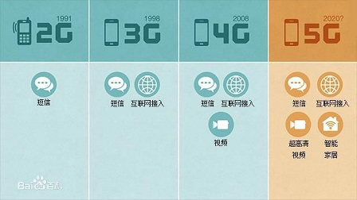

<!--more-->

NOT DONE

LTE系统有两种制式：FDD-LTE和TDD-LTE，即频分双工LTE系统和时分双工LTE系统，二者技术的主要区别在于空中接口的物理层上（像帧结构、时分设计、同步等）。FDD-LTE系统空口上下行传输采用一对对称的频段接收和发送数据，而TDD-LTE系统上下行则使用相同的频段在不同的时隙上传输，相对于FDD双工方式，TDD有着较高的频谱利用率。

----To Be Continued----